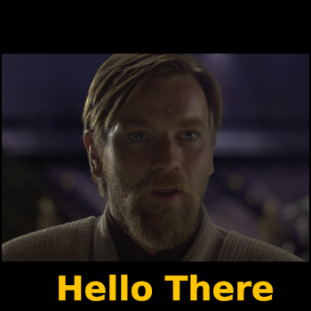

# Frontend Mentor - Jo-Ken-Pô!

Este é um projeto simples e divertido do clássico jogo **Pedra, Papel ou Tesoura (Jo-Ken-Pô!)**, desenvolvido com HTML, CSS e JavaScript puro. O jogo inclui uma pequena validação de idade inicial e um design responsivo, com foco na jogabilidade intuitiva e feedback claro ao usuário.

---

## Conteúdo

- [Visão Geral](#Visão-Geral)
  - [Screenshot](#Screenshot)
  - [Links](#Links)
- [Meu Processo](#Meu-Processo)
  - [Feito Com](#Feito-Com)
  - [O que Aprendi](#O-que-Aprendi)
  - [Continuando a me Desenvolver](#Continuando-a-me-Desenvolver)
  - [Recursos Úteis](#Recursos-Úteis)
- [Autor](#Autor)

---

## Visão Geral

### Screenshot

### Links

- **Live Site URL:** [GithubPages](https://rodolfo-brand.github.io/jokenpo/)
- **Repositório:** [GitHub](https://github.com/rodolfo-brand/jokenpo)

---

## Meu Processo

### Feito com

 
  
  
  

### O que Aprendi

Neste projeto, reforcei e pratiquei os seguintes conceitos:

* **Manipulação do DOM com JavaScript:** Seleção de elementos, adição de listeners de eventos e atualização dinâmica de conteúdo (resultados, jogada do computador).
* **Lógica de Jogo:** Implementação da lógica do jogo Pedra, Papel, Tesoura, incluindo a randomização da escolha do computador e a determinação do vencedor.
* **Estruturação de Código:** Organização do código JavaScript em funções para modularidade e legibilidade.
* **Estilização Responsiva com CSS:** Uso de media queries e unidades relativas (`vw`, `clamp`) para garantir que a interface seja adaptável a diferentes tamanhos de tela (desktop e mobile).
* **Modais e Interatividade:** Criação de um modal simples para a verificação de idade, adicionando uma camada de interatividade ao início do jogo.
* **Animações e Transições CSS:** Aplicação de transições suaves e efeitos de hover nos botões de jogada para melhorar a experiência do usuário.

### Continuando a me Desenvolver

Pretendo continuar aprimorando minhas habilidades em:

* **Refatoração de Código JavaScript:** Buscar formas de otimizar a lógica e tornar o código ainda mais limpo e escalável.
* **Acessibilidade (A11y):** Implementar melhorias de acessibilidade para que o jogo seja utilizável por um público mais amplo.
* **Testes Automatizados:** Adicionar testes unitários para a lógica do jogo, garantindo sua robustez.
* **Design de UI/UX:** Explorar mais princípios de design para criar interfaces ainda mais intuitivas e agradáveis.

### Recursos Úteis

* [Shields.io](https://shields.io/) - Para a criação dos badges de perfil e tecnologias.
* [Devicons](https://devicons.github.io/) - Ícones de tecnologias usados para os badges.
* [Postimages](https://postimages.org/) - Para hospedar imagens como o logo do título (`title.png`) e o background.

---

## Autor

  
  
  
  

